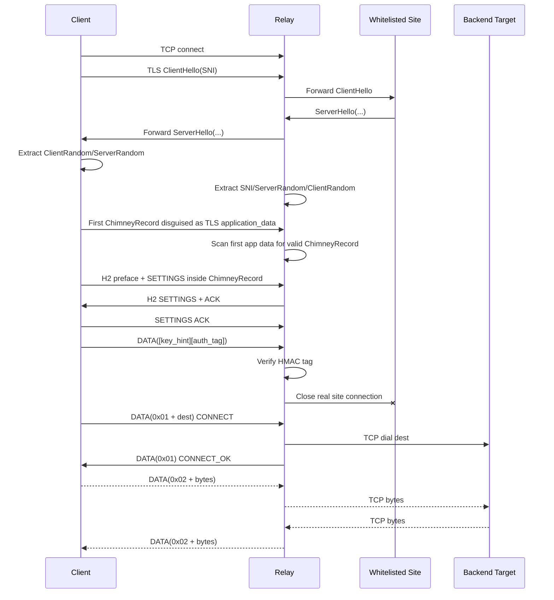

# Chimney Protocol 项目分析文档

本文档基于当前代码实现整理，优先描述“代码实际行为”，而不是早期设计意图。

## 1. 项目定位

Chimney 是一个会话寄生式传输原型。客户端先通过 relay 与白名单站点完成一次真实 TLS 握手，随后把连接切换为 Chimney 自定义记录层，在伪装成 TLS application_data 的记录内承载 HTTP/2 帧，并在 H2 DATA 上复用多条 TCP/UDP 子流。

项目同时提供：

- Go 库：`github.com/shuffleman/chimney-protocol`，导出 `Dialer`，可被其他 Go 程序集成。
- relay 服务端：`cmd/chimney-relay`。
- 本地 SOCKS5 客户端：`cmd/chimney-client`。
- 校准、探测、测速与压测工具：`cmd/h2probe`、`cmd/calibrate`、`cmd/socks_stress`、`cmd/remote-throughputtest` 等。

## 2. 目录结构

```text
.
├── chimney.go                      # 根包 Dialer，面向集成方的主要 API
├── cmd/
│   ├── chimney-client/             # 本地 SOCKS5 客户端
│   ├── chimney-relay/              # relay 服务端入口
│   ├── h2probe/                    # 真实站点 H2 SETTINGS 探测
│   ├── calibrate/                  # pcap/profile 校准工具
│   ├── socks_stress/               # 真实 SOCKS5 链路压测
│   └── remote-throughputtest/      # 通过根包 Dialer 做远端吞吐测试
├── internal/
│   ├── relay/                      # 服务端握手、swap、隧道、UDP/TCP 转发
│   ├── record/                     # ChimneyRecord AEAD 记录层
│   ├── h2engine/                   # H2 frame 编解码、SETTINGS、record I/O
│   ├── keyderiv/                   # HKDF 派生认证/会话/方向密钥
│   ├── auth/                       # auth tag、key hint、用户表
│   ├── whitelist/                  # intent + enforce 白名单
│   ├── config/                     # YAML 配置结构与校验
│   ├── profile/                    # 流量 profile 模型
│   ├── dilution/                   # 预录制内容块
│   └── pcap/                       # pcap 解析辅助
├── config/                         # 示例和测试配置
├── docs/                           # 补充文档
└── docker/                         # Dockerfile 与 compose 示例
```

## 3. 运行形态

### 3.1 relay

入口：`cmd/chimney-relay/main.go`

职责：

- 读取 `config/relay*.yaml`。
- 加载白名单和用户认证配置。
- 监听客户端 TCP 连接。
- 转发真实 TLS 握手到白名单 SNI。
- 验证 Chimney post-swap auth DATA。
- 切换为 H2 tunnel，处理 CONNECT、TCP DATA、UDP DATA。
- 可选启动 JSON admin API。

常用命令：

```powershell
.\build\bin\chimney-relay.exe -config .\config\relay-speedtest.yaml
```

Linux/systemd 部署时，本项目已验证可用：

```bash
/opt/chimney-protocol/chimney-relay -config /opt/chimney-protocol/config/relay-speedtest.yaml
```

### 3.2 CLI client

入口：`cmd/chimney-client/main.go`

职责：

- 通过 uTLS 模拟指定浏览器指纹。
- 与 relay 通过指定 SNI 建立真实 TLS 握手。
- 切到 ChimneyRecord + H2 tunnel。
- 在本地监听 SOCKS5，默认 `127.0.0.1:1080`。
- 维护单个底层 tunnel；当前实现加入 `tunnelManager`，隧道断开后会在下一次 SOCKS CONNECT 时自动重连，并在 stream open 失败时用新 tunnel 重试一次。

常用命令：

```powershell
.\build\bin\chimney-client.exe `
  -relay 103.135.147.226:8444 `
  -sni cloudflare.com `
  -dest 127.0.0.1:1 `
  -psk 0123456789abcdef0123456789abcdef0123456789abcdef0123456789abcdef `
  -listen 127.0.0.1:1080 `
  -fingerprint chrome
```

注意：`config/client.yaml.example` 是给 `internal/config.LoadClientConfig` 使用的模板；`cmd/chimney-client` 当前使用 CLI flags，不读取 `-config`。

### 3.3 Go 库 Dialer

入口：`chimney.go`

核心 API：

```go
d, err := chimney.NewDialer(chimney.Config{
    RelayAddr:   "relay.example.com:443",
    SNI:         "cloudflare.com",
    PSK:         "64-char-hex-psk",
    Fingerprint: "chrome",
    PoolSize:    4,
})
conn, err := d.DialContext(ctx, "tcp", "example.com:443")
```

根包 `Dialer` 和 CLI client 不完全共用实现：

- 根包支持 tunnel pool，默认 `PoolSize=4`。
- 根包按 round-robin 分配 stream。
- 根包已有 dead tunnel 懒重连逻辑。
- CLI client 是单 tunnel SOCKS5 代理，使用自己的 `tunnelManager`。

## 4. 协议主流程



关键点：

- relay 在认证成功前不解密真实 TLS 会话，只旁路转发握手。
- 当前认证 tag 不再塞入旧设计里的“首个 application_data 明文偏移”；而是在 swap 后作为 H2 DATA frame 发送，格式是 `[4B key_hint][tag]`。
- relay 会把真实站点连接关闭，然后在原客户端连接上接管 Chimney H2 tunnel。

## 5. 密钥与认证

相关模块：

- `internal/keyderiv`
- `internal/auth`

当前模型：

```text
K_auth = HKDF(PSK, label="chimney-auth", info=ServerRandom)
tag    = HMAC(K_auth, ServerRandom || ClientRandom)[:tag_len]
```

多用户模式：

- relay 支持 `users` 显式 PSK 映射。
- relay 支持 `user_ids`，每个用户的 PSK 由 `SHA256(userID)` 派生。
- client 如果未传 `-psk`，会用 `-user-id` 派生 PSK。
- auth frame 前 4 字节是 `key_hint`，relay 用它快速定位用户。

会话密钥：

- 使用 TLS `ServerRandom` 和 `ClientRandom` 派生方向密钥。
- client 的 send key 对应 client -> relay。
- relay 会调换方向，使用 client send key 作为 opener，client recv key 作为 sealer。

## 6. ChimneyRecord 记录层

模块：`internal/record`

外层记录格式：

```text
type    = 0x17
version = 0x0303
length  = ciphertext length
payload = AES-GCM(ciphertext)
```

当前实现细节：

- AEAD 使用 AES-GCM。
- nonce 是 12 字节 base nonce XOR record sequence。
- header 作为 AEAD additional data。
- sealer/opener 分别维护 sequence。
- opener 只在成功解密后推进 sequence，连续 AEAD 失败到阈值后返回 `ErrTooManyFailures`。
- Windows 写入问题有专门文档：`docs/windows-tcp-corruption.md`。

重要限制：

- 每条 ChimneyRecord 的明文是 H2 frame byte stream。
- `MaxPlaintextLen` 当前为 `66000`。
- 真实链路里为避免命令前缀被 H2 自动分片剥离，TCP tunnel 数据在 client/relay 两端按 `16KiB-1` 分片，每个 H2 DATA frame 都带自己的 `0x02` 命令字。

## 7. H2 隧道层

模块：`internal/h2engine`

职责：

- 生成/解析 H2 connection preface。
- 编解码 SETTINGS、DATA、RST_STREAM、GOAWAY 等 frame。
- 把 H2 frame 写入 ChimneyRecord。
- 提供 padding/dilution reserved stream。

当前 SETTINGS：

- `DefaultSettings()` 里通告 `MAX_FRAME_SIZE=16384`，`MaxFrameSizeActual` 与通告值一致。
- relay 若在 `intent.yaml` 里有 `settings_snapshot`，会用站点快照覆盖默认 SETTINGS。
- `DefaultMaxFrameSize=65536` 是内部缓冲/历史常量，不等于当前默认实际发送 frame size。

reserved streams：

- `PaddingStreamID = 0x0FFFFFFF`
- `DilutionStreamID = 0x0FFFFFFD`
- relay 在 `handleTunnel` 里直接丢弃 reserved stream frame。

## 8. 子流命令协议

H2 DATA payload 首字节是 Chimney 子协议命令：

| 命令 | 含义 | 方向 |
| --- | --- | --- |
| `0x01` | CONNECT / CONNECT_OK | client->relay 发送目标地址；relay->client 返回 OK |
| `0x02` | TCP DATA | 双向 |
| `0x03` | CLOSE | 双向/控制 |
| `0x04` | UDP datagram | 双向 |

TCP：

- client 建 stream 后发送 `0x01 + dest`。
- relay 创建 backend TCP 连接后返回 `0x01`。
- 数据双向使用 `0x02 + chunk`。
- 大块数据在发送方分片，保证每个 H2 DATA frame 都含命令字。

UDP：

- 根包提供 `ListenPacket(ctx)`。
- UDP datagram 格式：

```text
[0x04][addrType][addr][2B port][payload]
```

- relay 为 UDP stream 创建 UDP socket。
- UDP backend idle 超时后关闭。

## 9. 白名单与配置

相关模块：

- `internal/whitelist`
- `internal/config`
- `config/intent.yaml`
- `config/enforce.yaml`

白名单分两层：

- intent：允许的 SNI，并可携带 `settings_snapshot`。
- enforce：允许的 CIDR/云区域。

relay 配置认证方式三选一：

```yaml
user_ids:
  - "uuid"

users:
  "user1": "hex-psk"

psk: "hex-psk"
```

当前 `metrics_addr` 实际启动的是 JSON admin API，不是 Prometheus exporter。可用端点包括：

- `GET /health`
- `GET /admin/stats`
- `GET /admin/users`
- `POST /admin/users`
- `DELETE /admin/users`
- `POST /admin/refresh-cidrs`，当前返回 OK 文案，不执行真实刷新逻辑。

## 10. 流量模拟能力

profile：

- `internal/profile` 提供记录大小、延迟分布模型。
- client 可通过 `-profile` 加载 JSON profile，并按 profile 做 padding。
- relay `EnableProfiling` 为 true 时使用 `profile.DefaultModel()` 做简单 pacing。
- `profile_dir` 字段存在，但当前 relay 没有按站点从目录加载 profile 文件。

dilution：

- `internal/dilution` 可加载预录制内容块。
- client 或根包 Dialer 可向 `DilutionStreamID` 写入预录制块。
- relay 对 dilution reserved stream 当前只丢弃，不转发给真实站点。

## 11. 稳定性与并发控制

根包 Dialer：

- 默认 `PoolSize=4`。
- 每个 tunnel 有独立 TCP socket 和 frame dispatch goroutine。
- dead tunnel 会在下一次 `DialContext` 时被懒重建。
- dispatch 有 `tunnelIdleTimeout=30s` 滚动读 deadline，避免卡死。

CLI client：

- 当前是单 tunnel SOCKS5 代理。
- `tunnelManager` 会在下一次 SOCKS CONNECT 前检测 tunnel dead 状态并重连。
- `openStream` 失败后会强制重建 tunnel，并重试一次。

relay：

- 全局 backend dial 并发：`MaxConcurrentBackendDials=64`。
- 全局 backend 连接数：`MaxBackendConnsGlobal=128`。
- pending stream 上限：`maxPendingStreams=256`。
- 单 stream pending buffer 上限：`256 KiB`。
- backend 写入使用 per-stream channel，避免主 H2 frame loop 因单个 backend 阻塞。

## 12. 构建与测试

常用构建：

```powershell
go build -o build\bin\chimney-relay.exe .\cmd\chimney-relay
go build -o build\bin\chimney-client.exe .\cmd\chimney-client
go build -o build\bin\socks_stress.exe .\cmd\socks_stress
```

Linux relay 交叉编译：

```powershell
$env:GOOS='linux'
$env:GOARCH='amd64'
$env:CGO_ENABLED='0'
go build -o build\bin\chimney-relay-linux-amd64 .\cmd\chimney-relay
```

常规测试：

```powershell
go test ./...
go vet ./...
```

stress 测试：

```powershell
go test -tags stress -run TestLocalMixedTrafficStress -count=1 -timeout 3m -v
```

真实 SOCKS5 链路压测：

```powershell
.\build\bin\socks_stress.exe -socks 127.0.0.1:1080 -dl 12 -ul 12 -bytes 8388608 -timeout 180s
```

注意：

- Makefile 的 `test` 目标使用 `-race`。Windows 上如果缺少 `gcc`/cgo 工具链，`go test -race` 会失败；这属于本地工具链限制。
- `socks_stress` 会启动本地 backend，因此适合 relay 能访问本机 backend 的场景。远端 relay 测公网下载可直接用 `curl -x socks5h://127.0.0.1:1080 ...`。

## 13. 工具说明

| 工具 | 用途 |
| --- | --- |
| `cmd/chimney-relay` | relay 服务端 |
| `cmd/chimney-client` | 本地 SOCKS5 客户端 |
| `cmd/h2probe` | 连接真实站点抓取 H2 SETTINGS，可更新 `intent.yaml` |
| `cmd/calibrate` | 从 pcap/keylog 中提取 profile/settings |
| `cmd/socks_stress` | 通过 SOCKS5 做端到端字节校验压测 |
| `cmd/remote-throughputtest` | 使用根包 Dialer 测远端吞吐 |
| `cmd/upload_debug` | 上传路径诊断工具 |
| `cmd/tcp_raw_test` / `cmd/tcp_page_test` | TCP 行为复现/诊断 |
| `cmd/speedtest` | HTTP 代理测速辅助 |

## 14. 当前实现边界与注意事项

1. `cmd/chimney-client` 不读 YAML config，只接受 CLI flags。
2. `profile_dir` 字段尚未被 relay 用来加载站点 profile。
3. dilution 是 client/root package 写入 reserved stream，relay 当前丢弃该 stream。
4. `/admin/refresh-cidrs` 当前只是占位响应。
5. UDP 支持存在于根包 `ListenPacket` 和 relay UDP backend，但 CLI SOCKS5 只实现 CONNECT，不实现 SOCKS5 UDP ASSOCIATE。
6. 根包 `streamConn.Read` 仍兼容“无命令字的 continuation payload”，但当前修复后 TCP 正常路径应每个 H2 DATA frame 都带 `0x02`。
7. README 与完整规格文档已多次更新，但若继续演进协议，应以代码和本文档同步校准。

## 15. 建议后续整理

- 把根包 Dialer 和 CLI client 的 tunnel 管理逻辑收敛，减少双实现漂移。
- 为 CLI client 增加 `-config`，复用 `internal/config.ClientConfig`。
- 给 relay 增加真实 `profile_dir` 加载逻辑。
- 将 admin API 的 `refresh-cidrs` 从占位实现改为可观测任务。
- 增加针对“relay kill 后 CLI client 自动重连”的自动化集成测试。
- 如果 UDP 要进入生产路径，补 SOCKS5 UDP ASSOCIATE 或独立 UDP client。
